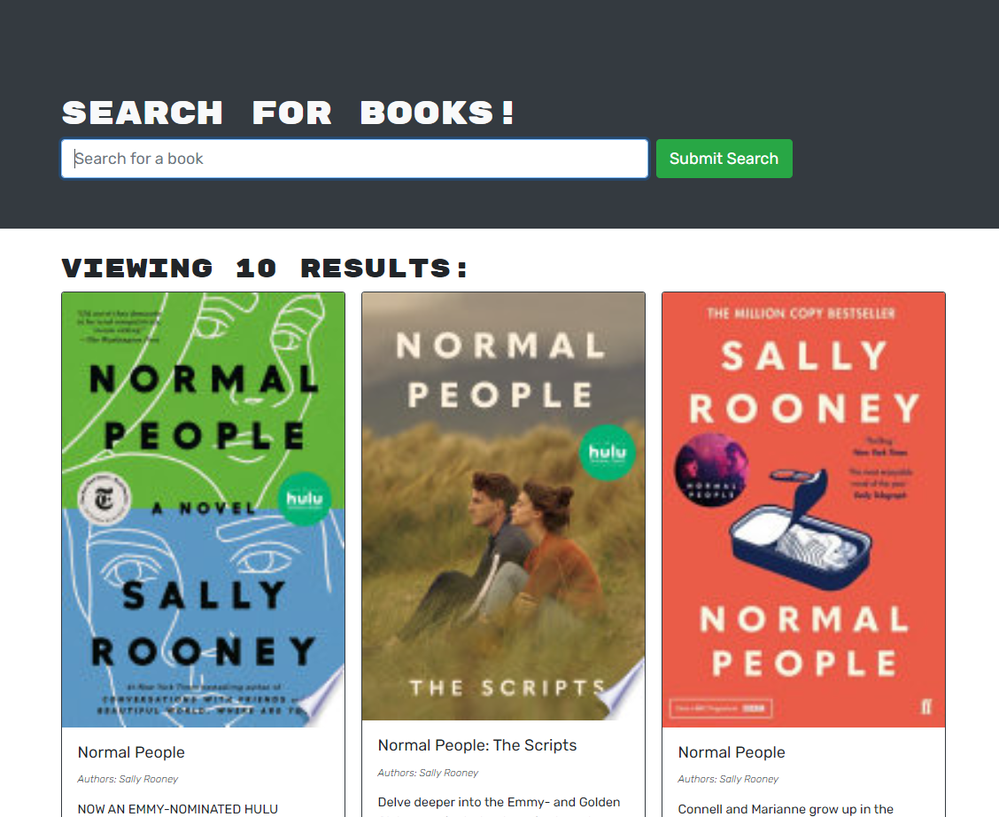

# Employee-Tracker


## About

Using the Google Books API, you can now search for the book you NEED. You're welcomeee!
## Table of Contents

* [Made-With](#Made-with)
* [Install](#Install)
* [Screenshots](#Screenshots)
* [Liscense](#Liscense)
* [Credits](#Contact)

## Made-With 

* React
* GraphQL
* Node.Js
* MongoDB
* Express

## Install

Start off by cloning the repository and opening it in VSCode. In your repos root directory, open the terminal and run ``` npm i ```.

Once completed, open a terminal in your repo and enter ``` npm start ``` to begin.

## Screenshots 



## Liscense

 This project is liscensed under the MIT liscense.
 
## Contact
Please email me at andrew@creativeaero.space if you have any questions